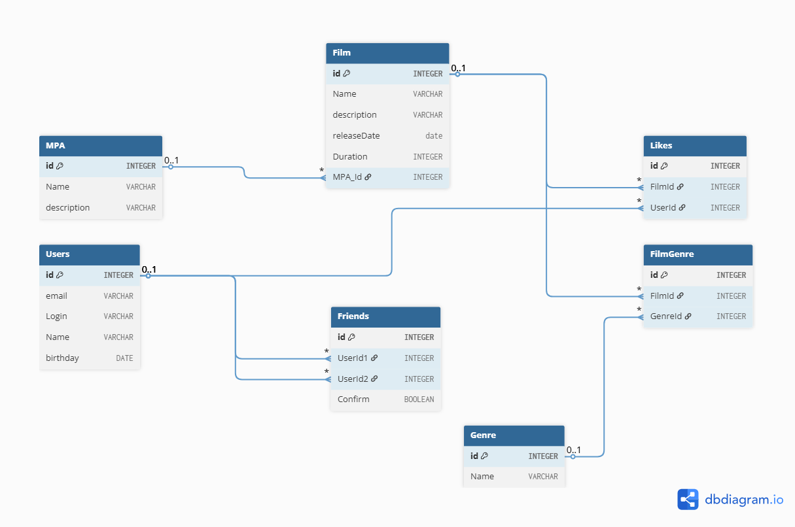

# java-filmorate
Template repository for Filmorate project.

# ErDiagram-FilmRate

# Пример запроса 
Получить информацию о фильме включая жанр,  рейтинг
>SELECT f.ID film_id,f.NAME,f.DESCRIPTION,f.RELEASEDATE,f.DURATION,   
&nbsp;&nbsp;&nbsp;&nbsp;       m.id mpa_id,m.NAME mpa_name,g.ID genre_id,g.NAME genre_name   
FROM FILMORATE.FILM f    
&nbsp;&nbsp;&nbsp;&nbsp;    LEFT JOIN FILMORATE.МРА m ON f.MPA_ID=m.id    
&nbsp;&nbsp;&nbsp;&nbsp;    LEFT JOIN FILMORATE.FILMGENRE fg ON fg.filmid=f.id   
&nbsp;&nbsp;&nbsp;&nbsp;   LEFT JOIN FILMORATE.GENRE g ON fg.genreid=g.id

